<div align="center">

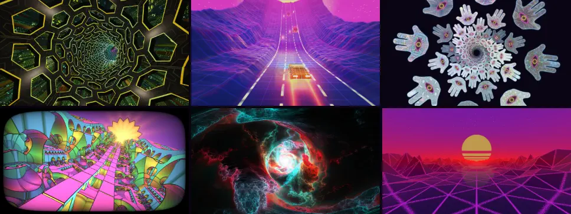

# 🌌 MOLTamp Widgets Galaxy

**A universe of GPU-powered widgets and visualizers for [MOLTamp](https://moltamp.com), orbiting around Claude.**

🪐 45 widgets · 🌠 40 visualizers · 🌌 5 constellations · 🎨 2 skins · 🛰️ zero network


[🚀 Launch](#-launch-sequence) · [📡 Ground control](#-ground-control) · [🌌 Constellations](#-constellations) · [🌠 Visualizers](#-visualizers) · [🎨 Skins](#-skins) · [🔭 Observatory](#-observatory) · [⭐ Star chart](#-star-chart)

</div>

---

## 🚀 Launch sequence

```bash
git clone https://github.com/jgourdin/moltamp-widgets-galaxy.git
cd moltamp-widgets-galaxy && ./install.sh
```

Then **restart MOLTamp** and pick your planets:

| To add… | Go to… |
|---|---|
| 🪐 a widget | **Settings › Tabs**, category **Shaders**, **Cyberpunk**, **Mission Control**, **Night Lounge** or **Starship**, then drag it into a tab |
| 🌠 a visualizer | the ⚙️ gear of the **Visualizer** widget, then pick the preset |
| 🎨 a skin | **Skins**, then pick **Galaxy** or **Starship Bridge** |

> [!TIP]
> Widgets fill their whole slot. They shine brightest in the **Vibes bar**, at the very top of the window.

## 📡 Ground control

The whole galaxy reacts to Claude. MOLTamp doesn't give widgets any audio, but they **feel Claude**: speed and intensity follow its state, and terminal throughput adds extra thrust.

| When Claude is… | the galaxy… |
|---|---|
| 😴 `idle` | drifts at 0.35×, deep-space cruise |
| 🤔 `thinking` | warms up its engines at 0.8× |
| ✍️ `streaming` | jumps to 1.25× and starts pulsing |
| 🛠️ `tool-use` | goes full thrust at 1.6× |
| ✋ `permission` | slows to 0.5× with a beacon flash |
| 💥 `error` | nearly stalls in orbit (0.25×) |
| ✅ `complete` | fires a victory flare, then back to calm |

"Audio" shaders get a **simulated spectrum** built from that activity. **Visualizers**, on the other hand, hear your Mac's real sound.

## 🌌 Constellations

### ✨ Shadertoy Nebula

Twenty classics from [Shadertoy](https://www.shadertoy.com), running their original GLSL inside MOLTamp.

<table>
<tr><td align="center" valign="top" width="33%">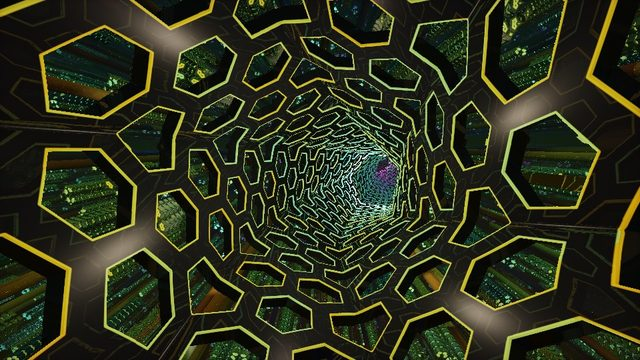<br><b>Hex Hive Tunnel</b><br><sub>A hexagonal crystal tunnel twisting forever.<br>by <i>nobody93</i></sub></td><td align="center" valign="top" width="33%">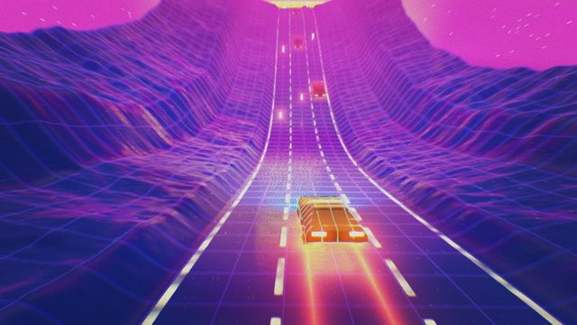<br><b>Sunset Drive</b><br><sub>A synthwave endless runner, steered by the beat.<br>by <i>Michal Klos & TheWindowStreamz</i></sub></td><td align="center" valign="top" width="33%">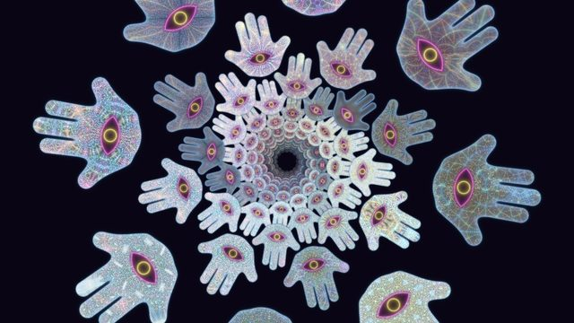<br><b>Infinite Hamsa</b><br><sub>An endless spiral of hamsa hands staring back.<br>by <i>noztol</i></sub></td></tr>
<tr><td align="center" valign="top" width="33%">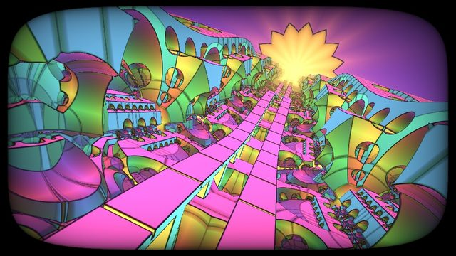<br><b>Fractal Land</b><br><sub>Cartoon flight over an infinite fractal landscape.<br>by <i>Kali</i></sub></td><td align="center" valign="top" width="33%">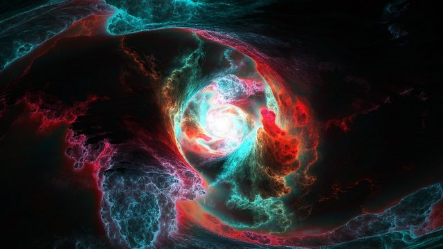<br><b>Coral Reef</b><br><sub>A glowing tunnel of fractal coral.<br>by <i>Yusef28</i></sub></td><td align="center" valign="top" width="33%">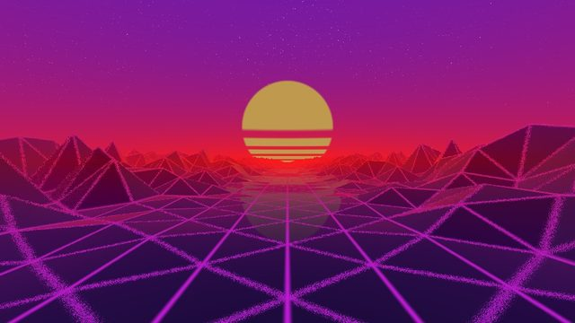<br><b>Synthwave Sunset</b><br><sub>Synthwave terrain under a striped retro sun.<br>by <i>axiomgraph</i></sub></td></tr>
<tr><td align="center" valign="top" width="33%"><br><b>Open Ocean</b><br><sub>Procedural ocean under a low sun; drag to look around.<br>by <i>afl_ext</i></sub></td><td align="center" valign="top" width="33%">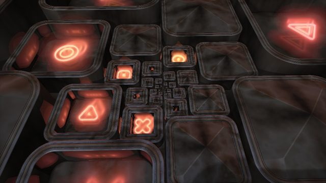<br><b>Fibonacci Zoom</b><br><sub>Endless zoom over metal tiles on a golden spiral.<br>by <i>Shane</i></sub></td><td align="center" valign="top" width="33%">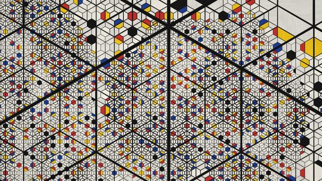<br><b>Mondrian Hexagons</b><br><sub>Mondrian hexagons that split and merge forever.<br>by <i>DavidBraun</i></sub></td></tr>
<tr><td align="center" valign="top" width="33%">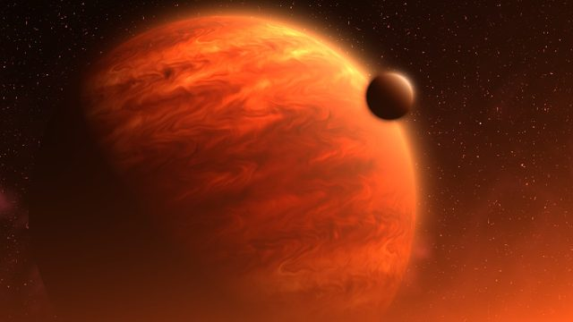<br><b>Jupiter & Io</b><br><sub>Jupiter's boiling bands with Io drifting by. Best in a wide slot.<br>by <i>edziewanowski</i></sub></td><td align="center" valign="top" width="33%">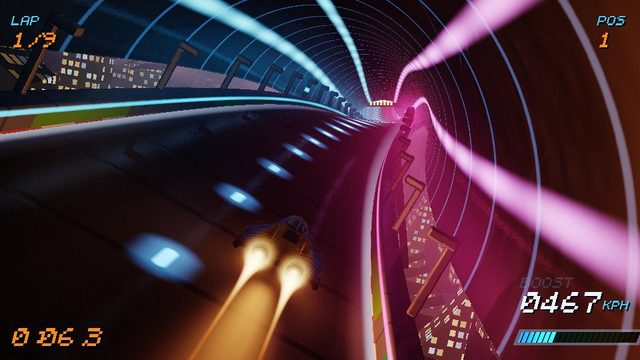<br><b>Neon Racer</b><br><sub>Anti-gravity racing through a neon city; hold click to steer.<br>by <i>Himred</i></sub></td><td align="center" valign="top" width="33%">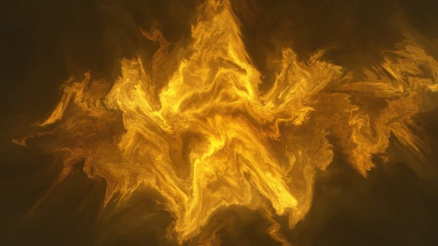<br><b>Spectralizer</b><br><sub>Volumetric smoke sculpted by a spectrum.<br>by <i>chronos</i></sub></td></tr>
<tr><td align="center" valign="top" width="33%">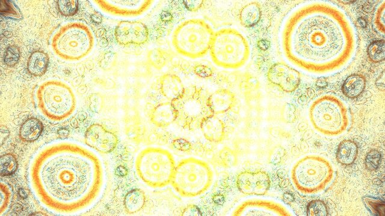<br><b>Fractal Kaleidoscope</b><br><sub>A psychedelic fractal kaleidoscope.<br>by <i>Patan77</i></sub></td><td align="center" valign="top" width="33%">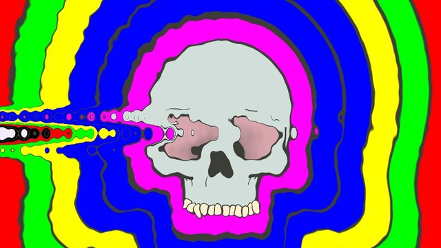<br><b>Psyche Skull</b><br><sub>A psychedelic skull wobbling to the rhythm.<br>by <i>im_paul_hi</i></sub></td><td align="center" valign="top" width="33%">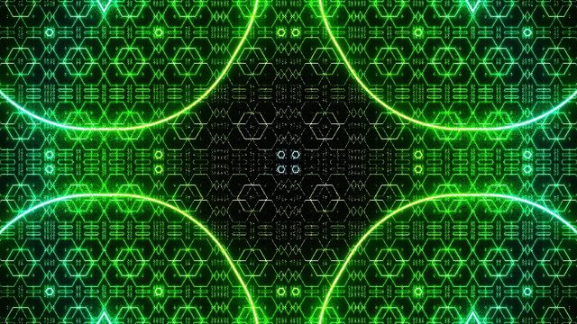<br><b>Sound Candy</b><br><sub>Neon hexagon rings looping to the rhythm.<br>by <i>Pink</i></sub></td></tr>
<tr><td align="center" valign="top" width="33%">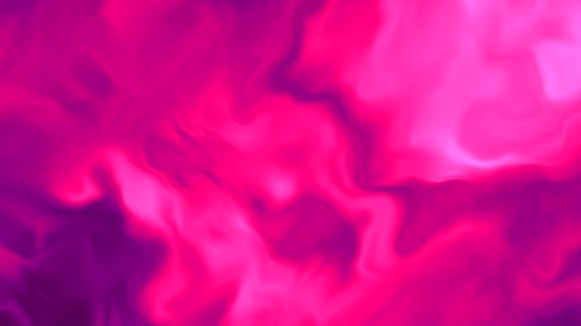<br><b>Liquid Warp</b><br><sub>Domain-warped fBM flowing like ink.<br>by <i>trinketMage</i></sub></td><td align="center" valign="top" width="33%">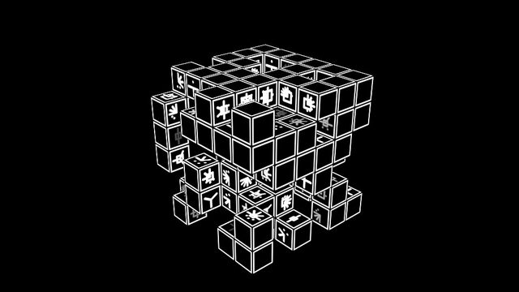<br><b>Artifakt Cubes</b><br><sub>Wireframe voxel cubes carved with glowing glyphs.<br>by <i>incre_ment</i></sub></td><td align="center" valign="top" width="33%">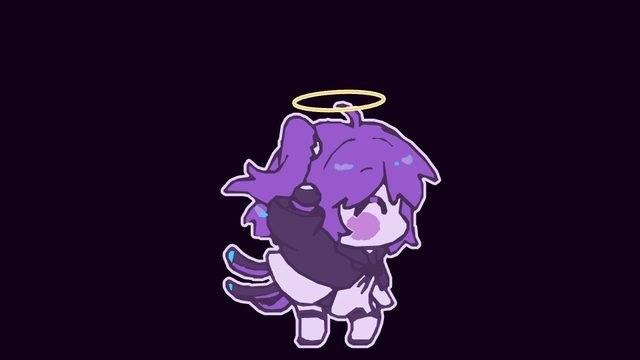<br><b>Exusiai Jump</b><br><sub>Exusiai's spin-and-jump sticker, in your skin colours.<br>by <i>KaltsitComeBack</i></sub></td></tr>
<tr><td align="center" valign="top" width="33%">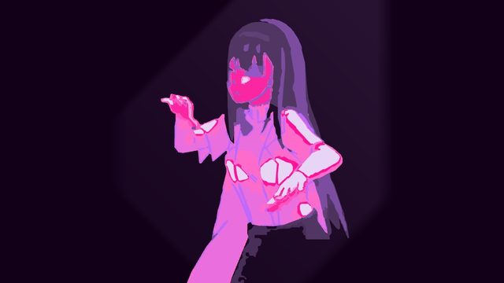<br><b>PRTS Dance</b><br><sub>PRTS dancing, in your skin colours.<br>by <i>KaltsitComeBack</i></sub></td><td align="center" valign="top" width="33%">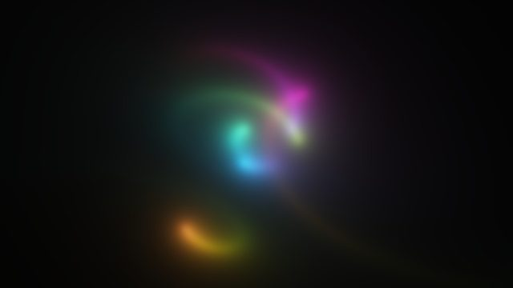<br><b>Shader Runner</b><br><sub>The engine behind all of them: drop your own shader in.<br>by <i>j0j0</i></sub></td></tr>
</table>

### 🌆 Cyberpunk District

Eight original widgets plugged straight into MOLTamp's live data: Claude's state, sub-agents, context, terminal throughput, system stats, Git. Pure Canvas 2D, painted in your skin colours, tested in light and dark skins.

<table>
<tr><td align="center" valign="top" width="33%">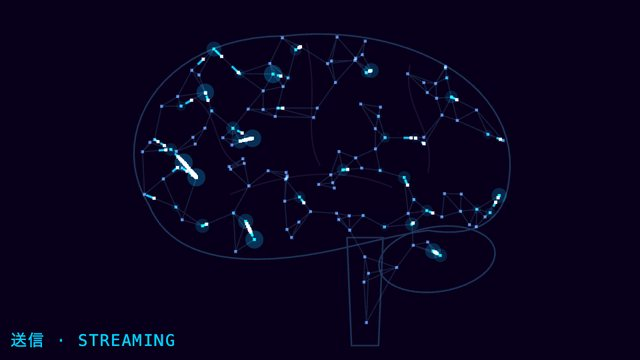<br><b>Neural Link</b><br><sub>A wireframe brain that fires with Claude: calm, impulses, data streams, red alert.<br>feeds on <i>Claude state</i></sub></td><td align="center" valign="top" width="33%">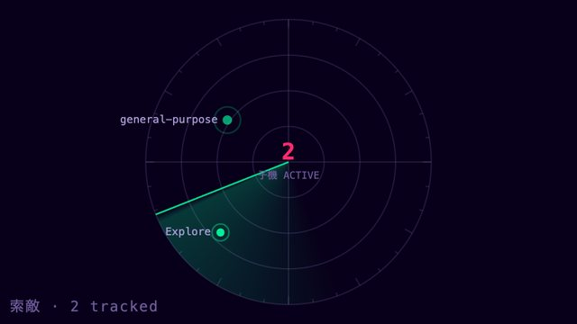<br><b>Agent Radar</b><br><sub>Every sub-agent becomes a blip on a sweeping radar.<br>feeds on <i>sub-agents</i></sub></td><td align="center" valign="top" width="33%">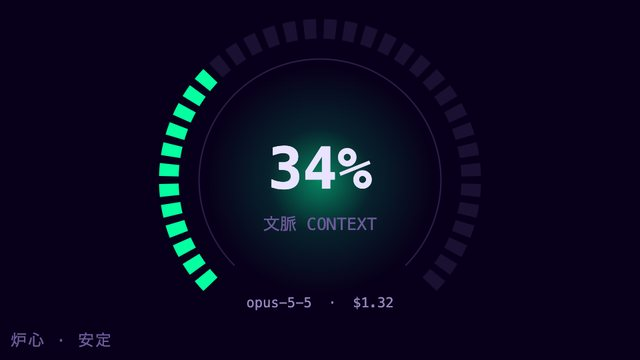<br><b>Context Core</b><br><sub>Context usage as a reactor core, from green to orange to red.<br>feeds on <i>context %</i></sub></td></tr>
<tr><td align="center" valign="top" width="33%">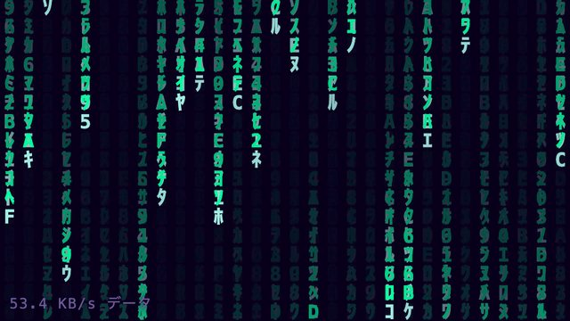<br><b>Data Rain</b><br><sub>A katakana and hex cascade that speeds up with the terminal.<br>feeds on <i>terminal bytes/s</i></sub></td><td align="center" valign="top" width="33%">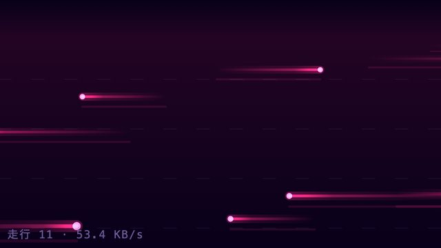<br><b>Light Trails</b><br><sub>Neon red streaks racing like a night-time bike chase.<br>feeds on <i>terminal activity</i></sub></td><td align="center" valign="top" width="33%">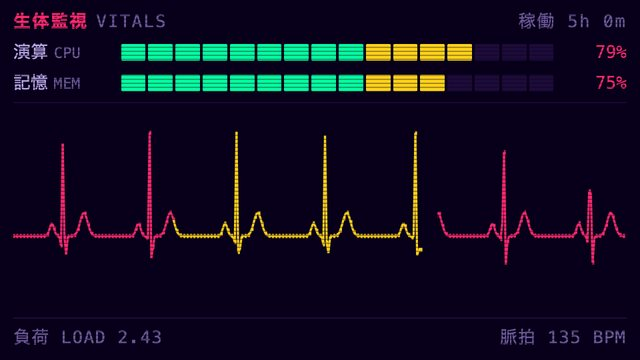<br><b>Cyber Vitals</b><br><sub>CPU and memory as vital signs, with a heartbeat that follows the load.<br>feeds on <i>system stats</i></sub></td></tr>
<tr><td align="center" valign="top" width="33%">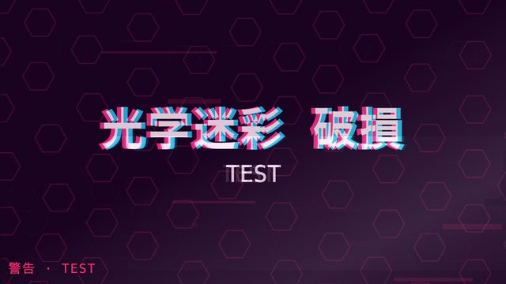<br><b>Optic Camo</b><br><sub>A near-invisible thermoptic shimmer that glitches when a command fails.<br>feeds on <i>errors &amp; hook events</i></sub></td><td align="center" valign="top" width="33%">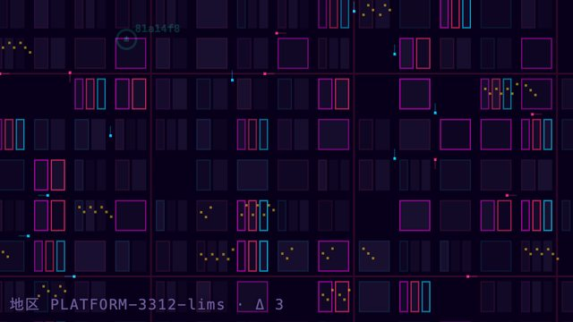<br><b>Neon City</b><br><sub>A top-down neon megacity; beacons flash on every new commit.<br>feeds on <i>Git status</i></sub></td></tr>
</table>

> [!NOTE]
> *Context Core* reads Claude's status line, so it only shows up for Claude sessions. *Optic Camo* can't distort the terminal itself (widgets are sandboxed): the glitch plays inside its own slot. Click it to preview.

### 🛰️ Mission Control

Seven original widgets for the long hours next to Claude: watch what it does, look back at where the time went, kill time while it works, and keep an eye on the fuel and the fare.

<table>
<tr><td align="center" valign="top" width="33%">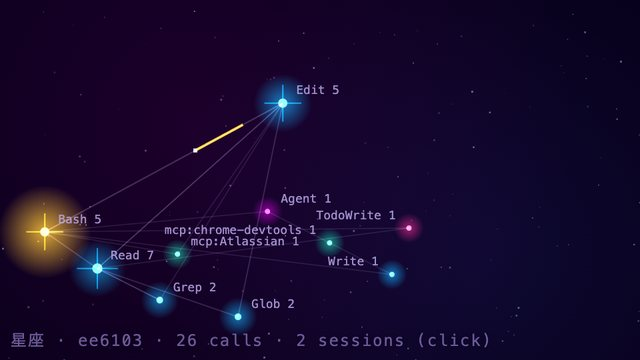<br><b>Tool Constellation</b><br><sub>Every tool Claude calls becomes a star, linked in the order of the calls. Click to switch session.<br>feeds on <i>hook events</i></sub></td><td align="center" valign="top" width="33%">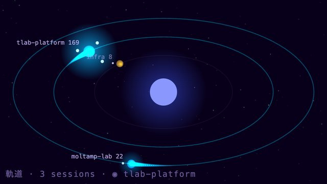<br><b>Session Orbits</b><br><sub>Each Claude Code session is a planet around Claude: the busy one leaves a comet trail, sub-agents become moons.<br>feeds on <i>hook events</i></sub></td><td align="center" valign="top" width="33%">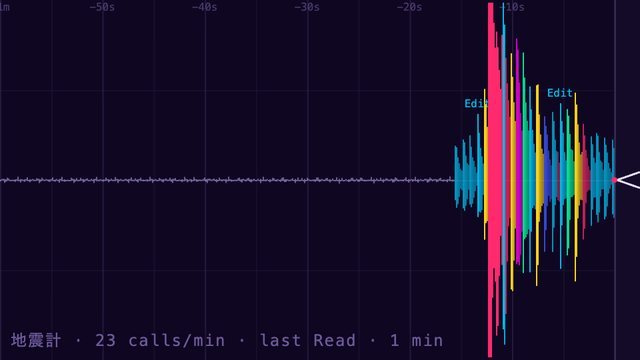<br><b>Hook Seismograph</b><br><sub>Every tool call shakes the needle in its colour; a failed call sets off a red earthquake. Click to change the window.<br>feeds on <i>hook events</i></sub></td></tr>
<tr><td align="center" valign="top" width="33%">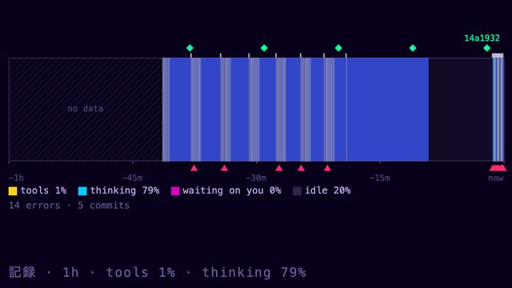<br><b>Flight Recorder</b><br><sub>The black box of the last hour: what Claude did, your prompts, errors, commits, and where the time went.<br>feeds on <i>hook events, Claude state, Git</i></sub></td><td align="center" valign="top" width="33%">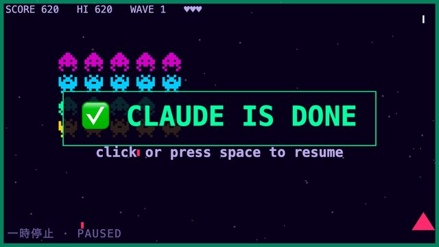<br><b>Waiting Arcade</b><br><sub>A pocket space shooter for while Claude works; it pauses and calls you back when Claude is done or needs you.<br>feeds on <i>Claude state + keyboard</i></sub></td><td align="center" valign="top" width="33%">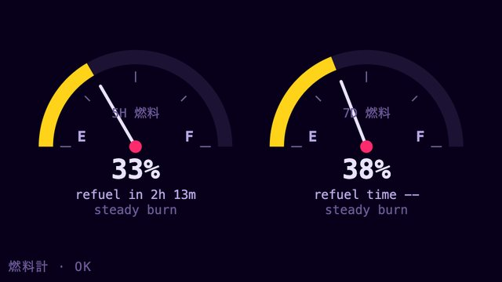<br><b>Rate Limit Fuel</b><br><sub>Your 5-hour and 7-day limits as fuel gauges, with refuel countdown and burn-rate ETA.<br>feeds on <i>rate limits</i></sub></td></tr>
<tr><td align="center" valign="top" width="33%">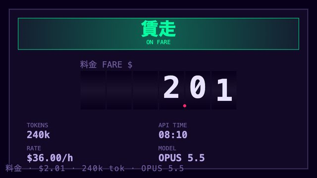<br><b>Taxi Meter</b><br><sub>The session fare rolling on mechanical drums, with tokens, API time, hourly rate and a lifetime odometer.<br>feeds on <i>session cost</i></sub></td></tr>
</table>

> [!NOTE]
> *Tool Constellation*, *Session Orbits*, *Hook Seismograph* and *Flight Recorder* light up from Claude Code hook events, so they show the past few minutes as soon as they load. *Waiting Arcade* plays with the arrows (or A/D, Q/D), fires with space and pauses with P. *Rate Limit Fuel* and the *Taxi Meter* fare, like *Context Core*, read Claude's status line: they stay offline until MOLTamp's status line is active (the taxi's lifetime odometer works without it).

### 🌃 Night Lounge

Three original widgets for the quiet hours: the weather outside, the music, and a little companion that grows with your work.

<table>
<tr><td align="center" valign="top" width="33%">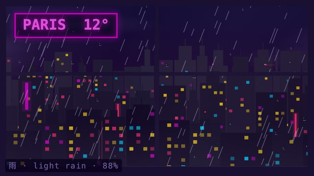<br><b>Night Window</b><br><sub>A rainy window onto a neon city at night: rain on the glass, snow, fog, lightning or the moon, from your real weather.<br>feeds on <i>local weather</i></sub></td><td align="center" valign="top" width="33%">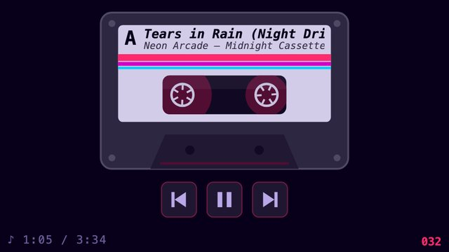<br><b>Cassette Deck</b><br><sub>Whatever your Mac is playing, on a spinning cassette with VU meters and working previous / play-pause / next buttons.<br>feeds on <i>now playing</i></sub></td><td align="center" valign="top" width="33%">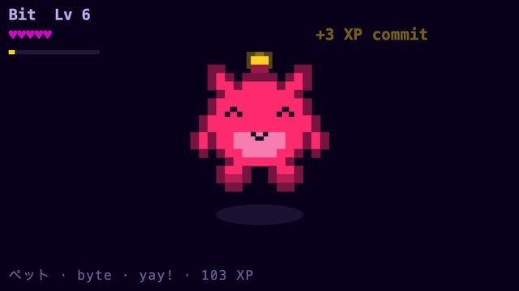<br><b>Token Pet</b><br><sub>A pixel creature that munches tokens while Claude writes, panics on errors, naps when it's quiet and evolves with every task and commit.<br>feeds on <i>Claude state, hook events, Git</i></sub></td></tr>
</table>

> [!NOTE]
> Click *Night Window*'s neon sign to type your city. *Cassette Deck* shows what macOS reports as now playing; album art only shows up when MOLTamp hands it over inline (widgets can't load remote images). *Token Pet* keeps its level in the widget settings, so it survives restarts.

### 🚀 Starship

Seven original widgets that turn MOLTamp into a starship flown by Claude: a main screen, a 3D map of your codebase, a black hole made of context, a fleet of sub-agents, a log of the planets you discover, a star chart of your year, and a radio that plays the voyage.

<table>
<tr><td align="center" valign="top" width="33%">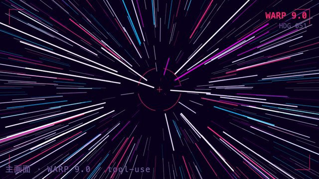<br><b>Viewscreen</b><br><sub>The main screen: cruise when Claude is idle, warp while it works, yellow alert when it waits for you, red alert on errors.<br>feeds on <i>Claude state</i></sub></td><td align="center" valign="top" width="33%">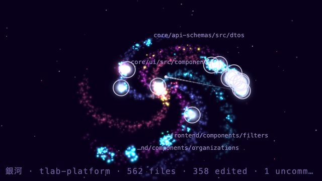<br><b>Codebase Cosmos</b><br><sub>Your repo as a 3D galaxy: one arm per top folder, one star per file; edits grow stars, commits set off supernovas.<br>feeds on <i>hook events, Git</i></sub></td><td align="center" valign="top" width="33%">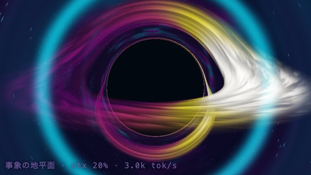<br><b>Event Horizon</b><br><sub>A black hole whose horizon grows with your context window; a compaction releases a burst of Hawking radiation.<br>feeds on <i>context, tokens</i></sub></td></tr>
<tr><td align="center" valign="top" width="33%">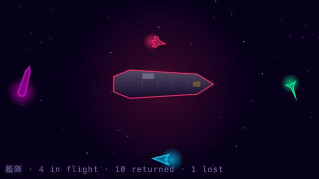<br><b>Agent Fleet</b><br><sub>Sub-agents launch from the mothership, fly in formation while they run and dock when they are done.<br>feeds on <i>hook events</i></sub></td><td align="center" valign="top" width="33%">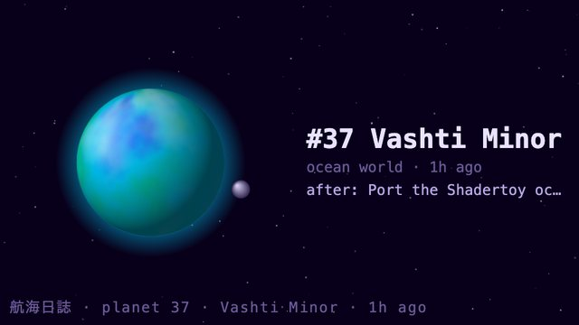<br><b>Planet Log</b><br><sub>Every finished task is a hyperspace jump to a new procedural planet, kept in a log you can browse.<br>feeds on <i>hook events, Git</i></sub></td><td align="center" valign="top" width="33%">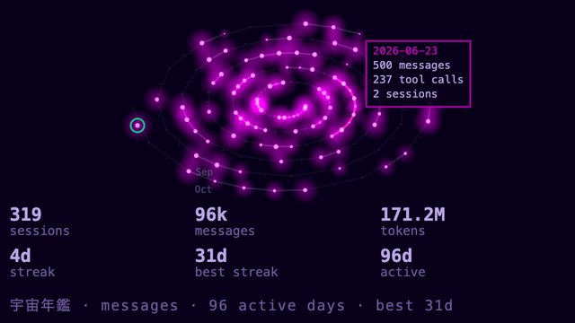<br><b>Year in Space</b><br><sub>Your year with Claude as a star chart: one star per day, streaks traced as constellations.<br>feeds on <i>lifetime stats</i></sub></td></tr>
<tr><td align="center" valign="top" width="33%">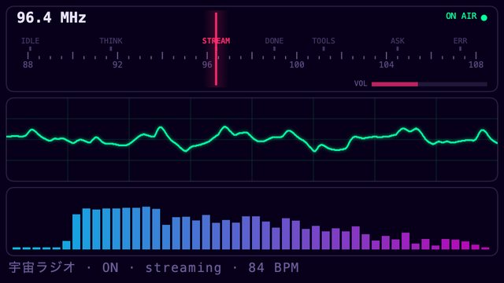<br><b>Deep Space Radio</b><br><sub>A generative ambient soundtrack that follows Claude, and drives your visualizers.<br>feeds on <i>Claude state, hook events</i></sub></td></tr>
</table>

> [!TIP]
> Pair them with the **Starship Bridge** skin: its default layout puts the Viewscreen and Event Horizon on the main screen and the rest on the HELM, SCIENCE, LOG and COMMS consoles. *Deep Space Radio* needs one click to start (browsers never autoplay sound); since visualizers listen to your Mac's audio, Claude's soundtrack makes them dance too.

## 🌠 Visualizers

The sound of the galaxy. Pick them from the ⚙️ gear of the Visualizer widget: they react to everything coming out of your speakers (Spotify, YouTube, anything).

<table>
<tr><td align="center" valign="top" width="33%">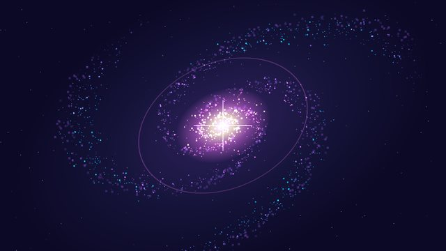<br><b>Audio Galaxy</b> <sub>· Canvas 2D</sub><br><sub>A spiral galaxy dancing to your music: arms spin with the bass, stars twinkle with the highs, the core flares on the beat.<br>by <i>j0j0</i></sub></td><td align="center" valign="top" width="33%">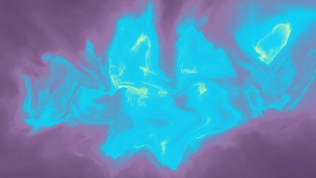<br><b>Spectralizer</b> <sub>· GPU</sub><br><sub>The smoke, sculpted by your music's real spectrum.<br>by <i>chronos</i></sub></td><td align="center" valign="top" width="33%">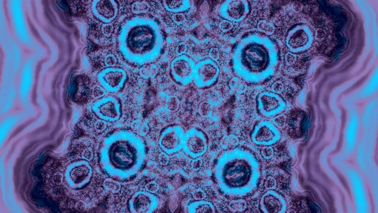<br><b>Fractal Kaleidoscope</b> <sub>· GPU</sub><br><sub>The kaleidoscope, driven by bass, mids and highs.<br>by <i>Patan77</i></sub></td></tr>
<tr><td align="center" valign="top" width="33%">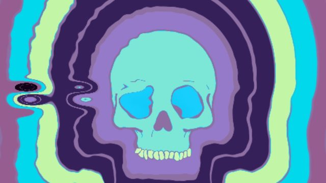<br><b>Psyche Skull</b> <sub>· GPU</sub><br><sub>The skull, warped by the highs and lows.<br>by <i>im_paul_hi</i></sub></td><td align="center" valign="top" width="33%">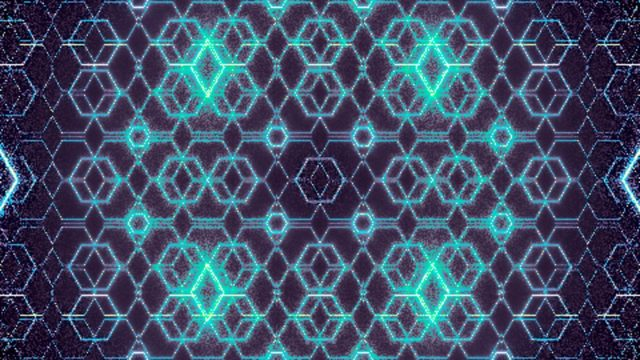<br><b>Sound Candy</b> <sub>· GPU</sub><br><sub>Neon rings pulsing with the volume.<br>by <i>Pink</i></sub></td><td align="center" valign="top" width="33%">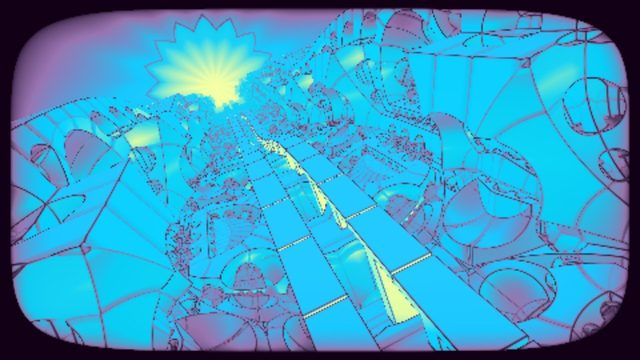<br><b>Fractal Land</b> <sub>· GPU</sub><br><sub>The fractal flight, with waves riding the music.<br>by <i>Kali</i></sub></td></tr>
<tr><td align="center" valign="top" width="33%">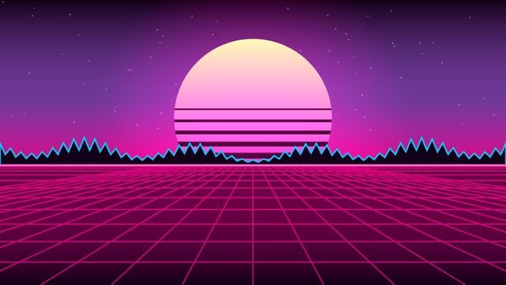<br><b>Synthwave Sunset</b> <sub>· Canvas 2D</sub><br><sub>Retro sun, neon grid and spectrum-shaped mountains.<br>by <i>axiomgraph</i></sub></td><td align="center" valign="top" width="33%">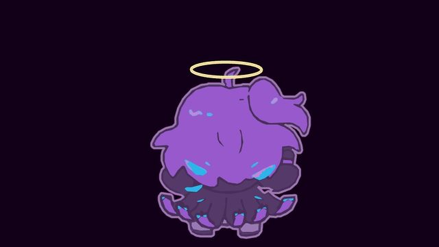<br><b>Exusiai Jump</b> <sub>· Canvas 2D</sub><br><sub>Exusiai dances faster with the bass and hops on every beat.<br>by <i>KaltsitComeBack</i></sub></td><td align="center" valign="top" width="33%">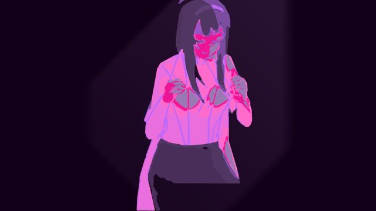<br><b>PRTS Dance</b> <sub>· Canvas 2D</sub><br><sub>PRTS dances to the bass and pulses on every beat.<br>by <i>KaltsitComeBack</i></sub></td></tr>
</table>

### 🎵 Music mode

Widgets can't hear sound in MOLTamp (they only see Claude), and visualizers can't see Claude (they only hear sound). So the widgets got **music twins**: the same scenes, rebuilt as visualizer presets that dance to whatever your Mac is playing (bass, mids, highs and every beat, with our own kick detector backing up MOLTamp's). Put a twin next to its widget and the scene reacts to both.

<table>
<tr><td align="center" valign="top" width="33%">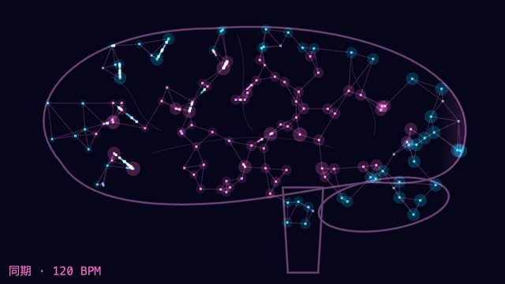<br><b>Neural Link ♪</b> <sub>· Canvas 2D</sub><br><sub>The wireframe brain wired to your music: the bass fires the deep neurons, the highs spark the cortex, every beat sends a synaptic wave across and the energy drives the data streams.<br>by <i>j0j0</i></sub></td><td align="center" valign="top" width="33%">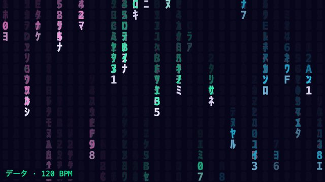<br><b>Data Rain ♪</b> <sub>· Canvas 2D</sub><br><sub>The katakana and hex cascade as a spectrum: each column falls with its own frequency band, every beat flashes bright heads across the screen, and silence turns it into a slow drizzle.<br>by <i>j0j0</i></sub></td><td align="center" valign="top" width="33%">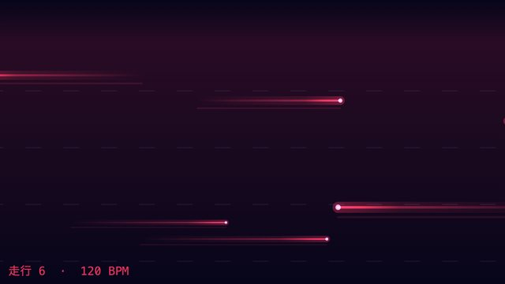<br><b>Light Trails ♪</b> <sub>· Canvas 2D</sub><br><sub>Neon bike streaks racing to your music: the bass sets the speed, every beat sends a new rider, the dominant band paints it, and the highs throw sparks off the road.<br>by <i>j0j0</i></sub></td></tr>
<tr><td align="center" valign="top" width="33%">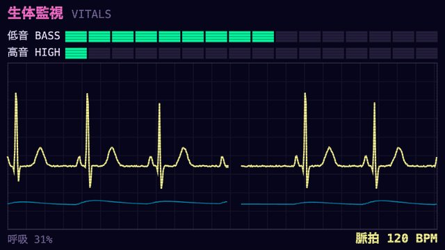<br><b>Cyber Vitals ♪</b> <sub>· Canvas 2D</sub><br><sub>A cardiac monitor for your music: every beat draws a heartbeat on the ECG with its BPM, the energy breathes on a second trace, and silence flatlines into NO SIGNAL.<br>by <i>j0j0</i></sub></td><td align="center" valign="top" width="33%">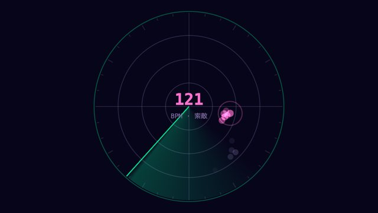<br><b>Agent Radar ♪</b> <sub>· Canvas 2D</sub><br><sub>The Agent Radar, tuned to your music: every beat drops a blip at the angle of the loudest band, the range rings pulse with the bass and the sweep turns to the tempo.<br>by <i>j0j0</i></sub></td><td align="center" valign="top" width="33%">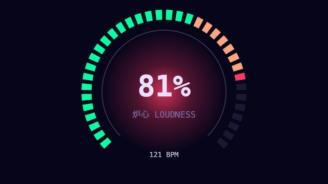<br><b>Reactor Core ♪</b> <sub>· Canvas 2D</sub><br><sub>The Context Core reactor running on your music: the gauge fills with the loudness from green to orange to red, the core throbs on every beat and a sudden drop after a loud passage triggers a SCRAM flash.<br>by <i>j0j0</i></sub></td></tr>
<tr><td align="center" valign="top" width="33%">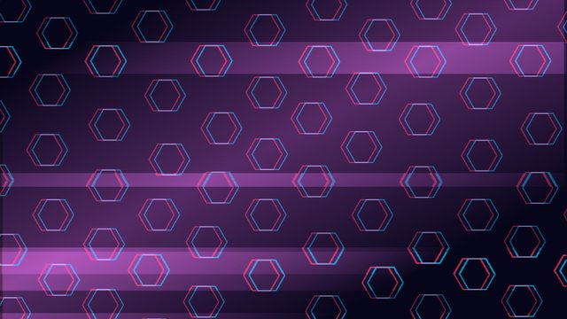<br><b>Optic Camo ♪</b> <sub>· Canvas 2D</sub><br><sub>The thermoptic camouflage, cloaking to your music: the highs make the air shimmer, every beat tears it into glitch slices with an RGB split, and silence leaves it almost invisible.<br>by <i>j0j0</i></sub></td><td align="center" valign="top" width="33%">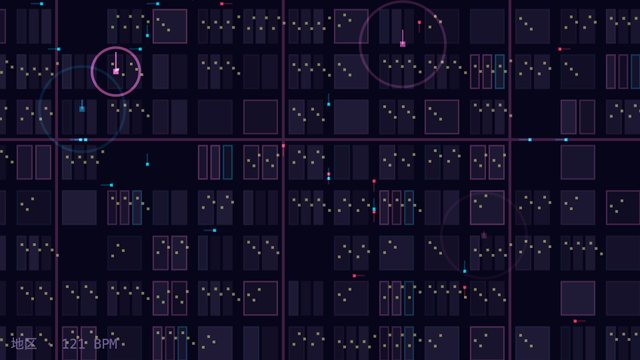<br><b>Neon City ♪</b> <sub>· Canvas 2D</sub><br><sub>The neon megacity seen from above, partying to your music: windows light up with the mids, traffic speeds up with the energy, a beacon pops on every beat and the avenues breathe with the bass.<br>by <i>j0j0</i></sub></td><td align="center" valign="top" width="33%">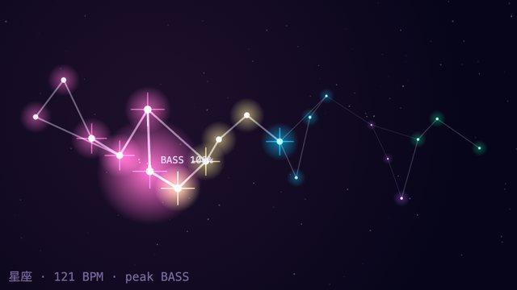<br><b>Spectrum Constellation ♪</b> <sub>· Canvas 2D</sub><br><sub>Your music as a constellation: one star per frequency band, glowing with its level, linked to its neighbours, with a shooting star from the loudest band on every beat.<br>by <i>j0j0</i></sub></td></tr>
<tr><td align="center" valign="top" width="33%">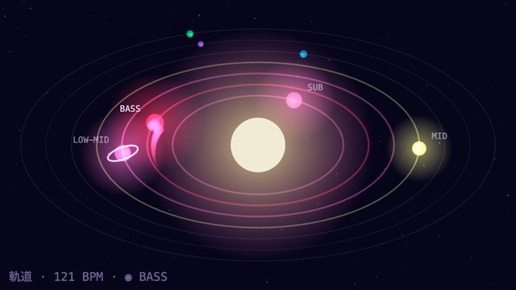<br><b>Orbital EQ ♪</b> <sub>· Canvas 2D</sub><br><sub>An equalizer in orbit: seven planets, one per frequency band from the bass inside to the air outside, swell with their level and circle in time with the tempo, while the sun pulses on every beat and the loudest band leaves a comet trail.<br>by <i>j0j0</i></sub></td><td align="center" valign="top" width="33%">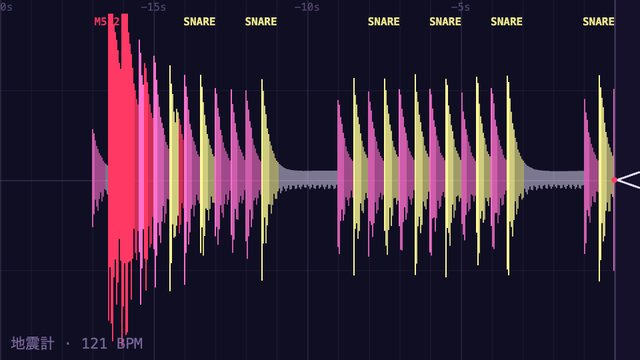<br><b>Beat Seismograph ♪</b> <sub>· Canvas 2D</sub><br><sub>A seismograph listening to your music: the needle trembles with the energy, every beat is a shock coloured by its kick, snare or hat, and a drop after a quiet break sets off an earthquake with its magnitude.<br>by <i>j0j0</i></sub></td><td align="center" valign="top" width="33%">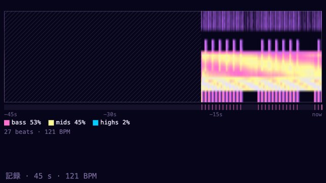<br><b>Flight Recorder ♪</b> <sub>· Canvas 2D</sub><br><sub>The black box of your track: a scrolling spectrogram of the last 45 seconds with every beat ticked on a marker lane, the tempo and how the sound splits between bass, mids and highs.<br>by <i>j0j0</i></sub></td></tr>
<tr><td align="center" valign="top" width="33%">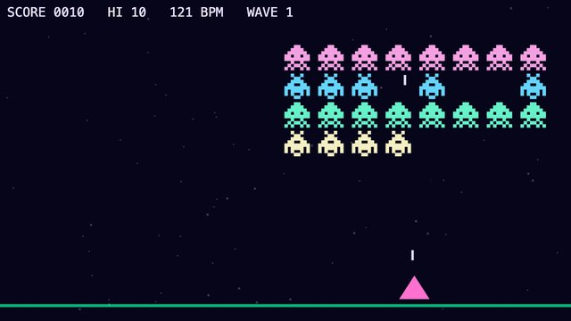<br><b>Waiting Arcade ♪</b> <sub>· Canvas 2D</sub><br><sub>Attract-mode space invaders that march one step per beat, with a pilot that fires on the hits and explosions that flare with the highs.<br>by <i>j0j0</i></sub></td><td align="center" valign="top" width="33%">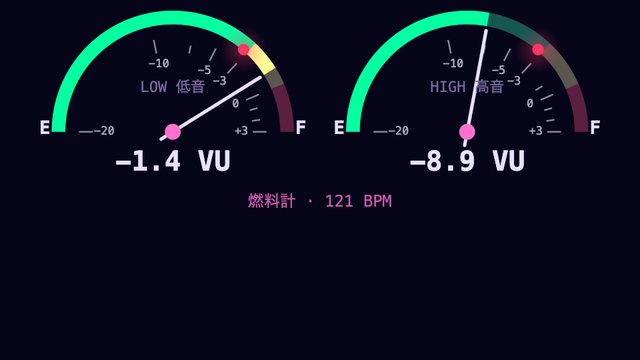<br><b>Fuel VU ♪</b> <sub>· Canvas 2D</sub><br><sub>The twin fuel gauges turned into VU meters: the left needle swings with the bass, the right one with the highs, with real VU ballistics and peak lamps.<br>by <i>j0j0</i></sub></td><td align="center" valign="top" width="33%">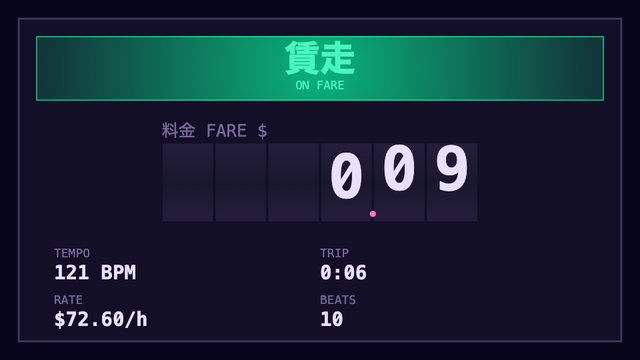<br><b>Beat Taxi ♪</b> <sub>· Canvas 2D</sub><br><sub>The retro taxi meter charging by the beat: every kick rolls the fare drums up a cent, with the tempo, trip time and hourly rate on the side and the roof lamp lit while the music plays.<br>by <i>j0j0</i></sub></td></tr>
<tr><td align="center" valign="top" width="33%">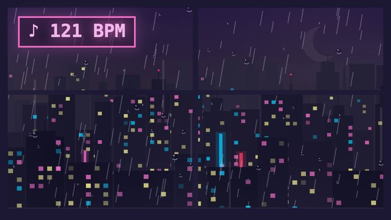<br><b>Night Window ♪</b> <sub>· Canvas 2D</sub><br><sub>The rainy neon window, soaked by your music: the rain follows the energy, drops hit the glass on every beat, the city lights flicker with the mids and lightning strikes on the big drops; silence brings back a clear starry night.<br>by <i>j0j0</i></sub></td><td align="center" valign="top" width="33%">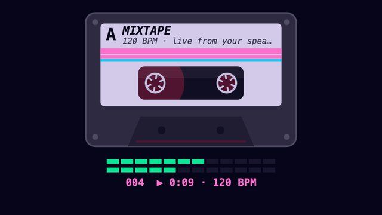<br><b>Tape Deck ♪</b> <sub>· Canvas 2D</sub><br><sub>A mixtape in a tape deck that plays along with your music: the reels spin with the tempo, the tape winds as the songs go by and the VU meters bounce with the real levels.<br>by <i>j0j0</i></sub></td><td align="center" valign="top" width="33%">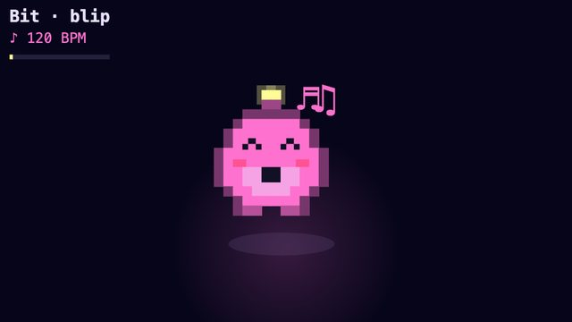<br><b>Token Pet ♪</b> <sub>· Canvas 2D</sub><br><sub>Token Pet dances to your music: it hops on every beat, sways with the bass, sends notes flying, grows up as the beats add up and dozes off when the music stops.<br>by <i>j0j0</i></sub></td></tr>
<tr><td align="center" valign="top" width="33%">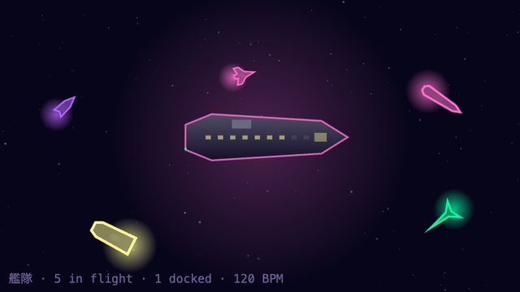<br><b>Agent Fleet ♪</b> <sub>· Canvas 2D</sub><br><sub>The Agent Fleet flies to your music: the formation breathes with the beat, a new ship launches every four beats and docks a few bars later, engine trails stretch with the bass.<br>by <i>j0j0</i></sub></td><td align="center" valign="top" width="33%">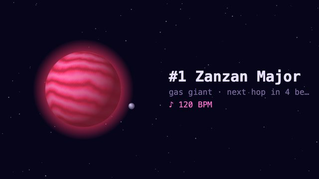<br><b>Planet Pulse ♪</b> <sub>· Canvas 2D</sub><br><sub>A procedural planet that pulses with your music: the atmosphere glows with the energy, the rings shimmer with the highs, the moons orbit to the tempo, and every 16 beats a hyperspace hop finds a new named world.<br>by <i>j0j0</i></sub></td><td align="center" valign="top" width="33%">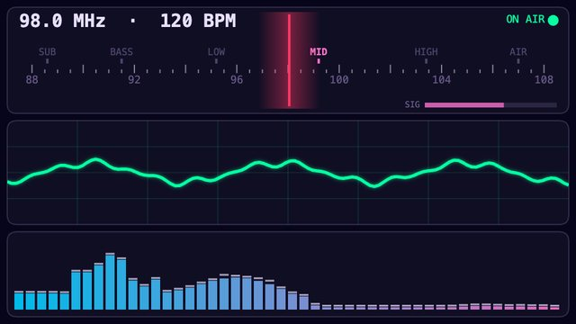<br><b>Radio Scope ♪</b> <sub>· Canvas 2D</sub><br><sub>Deep Space Radio's dial, oscilloscope and spectrum fed with whatever is playing: the scope traces the real waveform, the needle drifts to where the energy sits and the dial reads the tempo.<br>by <i>j0j0</i></sub></td></tr>
<tr><td align="center" valign="top" width="33%">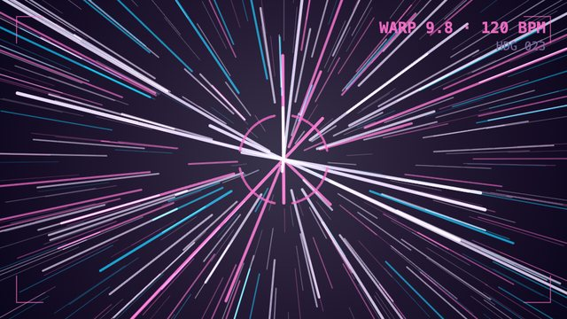<br><b>Warp Drive ♪</b> <sub>· Canvas 2D</sub><br><sub>The Viewscreen, flown by your music: the bass pushes the warp factor, every beat punches a hyperspace jump and the highs light up the star streaks.<br>by <i>j0j0</i></sub></td><td align="center" valign="top" width="33%">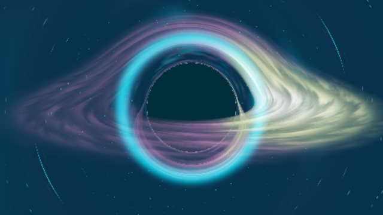<br><b>Event Horizon ♪</b> <sub>· GPU</sub><br><sub>The Starship black hole, played by your music: the bass heats and spins the accretion disk, the mids swell the horizon, the highs make the photon ring sparkle and every beat releases a flash of Hawking radiation.<br>by <i>j0j0</i></sub></td><td align="center" valign="top" width="33%">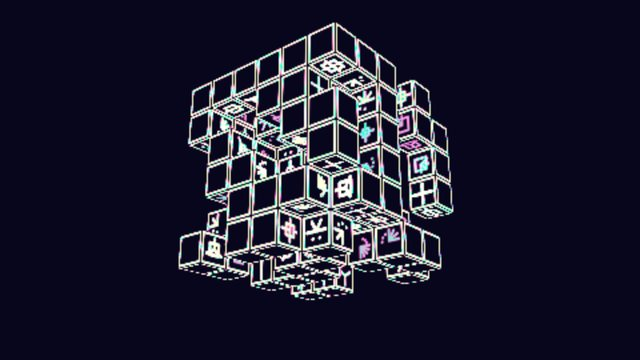<br><b>Artifakt Cubes ♪</b> <sub>· GPU</sub><br><sub>The wireframe voxel cubes and their glyphs, carving faster with the bass and flaring on the beat.<br>by <i>incre_ment (port: j0j0)</i></sub></td></tr>
<tr><td align="center" valign="top" width="33%">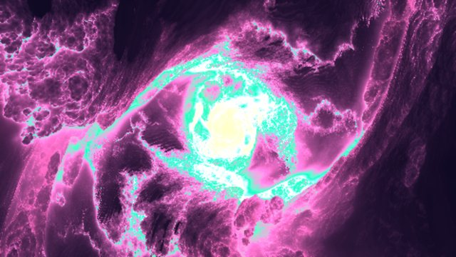<br><b>Coral Reef ♪</b> <sub>· GPU</sub><br><sub>The glowing coral tunnel, pushed through by the bass, pulsing on every beat.<br>by <i>Yusef28 (port: j0j0)</i></sub></td><td align="center" valign="top" width="33%">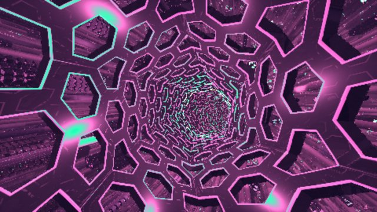<br><b>Hex Hive Tunnel ♪</b> <sub>· GPU</sub><br><sub>The hexagonal crystal tunnel, flown by your music: the bass speeds up the dive and every beat flashes the lattice.<br>by <i>nobody93 (port: j0j0)</i></sub></td><td align="center" valign="top" width="33%"><br><b>Infinite Hamsa ♪</b> <sub>· GPU</sub><br><sub>The endless spiral of hamsa hands, spinning faster with the bass and blinking on the beat.<br>by <i>noztol (port: j0j0)</i></sub></td></tr>
<tr><td align="center" valign="top" width="33%">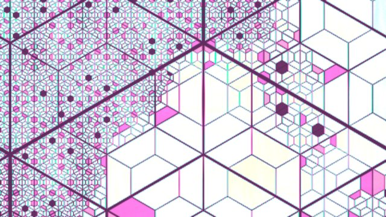<br><b>Mondrian Hexagons ♪</b> <sub>· GPU</sub><br><sub>Mondrian hexagons that split and merge to the tempo, punched by every beat.<br>by <i>DavidBraun (port: j0j0)</i></sub></td><td align="center" valign="top" width="33%">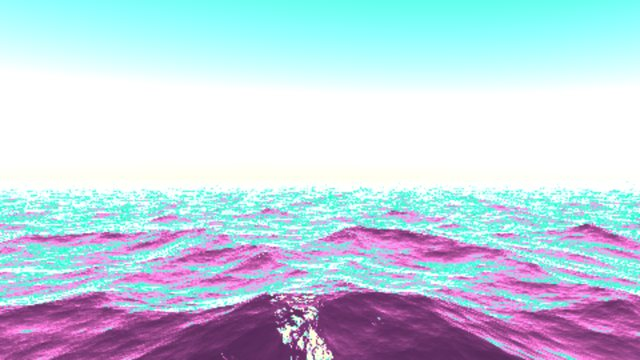<br><b>Open Ocean ♪</b> <sub>· GPU</sub><br><sub>The procedural ocean, whose swell rises and races with the music; each beat catches the light.<br>by <i>afl_ext (port: j0j0)</i></sub></td><td align="center" valign="top" width="33%">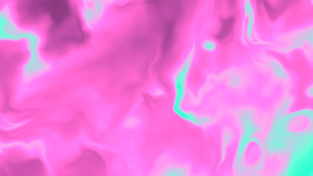<br><b>Liquid Warp ♪</b> <sub>· GPU</sub><br><sub>Domain-warped ink flowing faster with the bass, rippling on every beat.<br>by <i>trinketMage (port: j0j0)</i></sub></td></tr>
<tr><td align="center" valign="top" width="33%">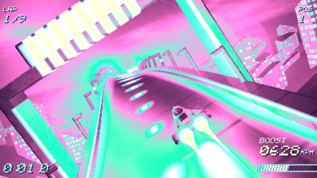<br><b>Neon Racer ♪</b> <sub>· GPU</sub><br><sub>Anti-gravity racing at the speed of your music: the bass is the throttle, every beat a boost.<br>by <i>Himred (port: j0j0)</i></sub></td></tr>
</table>

> [!TIP]
> Visualizers hear your Mac's real output (Spotify, YouTube, anything). If they stay still, allow MOLTamp in **System Settings › Privacy & Security › Screen & System Audio Recording**. Turn on *Deep Space Radio* and they also dance to Claude's own soundtrack.

- **GPU**: the original GLSL runs inside the visualizer worker, fed with the real spectrum and painted in your skin colours.
- **Canvas 2D**: feather-light, 100% skin colours, and it jumps on every beat. *Audio Galaxy* is original work by j0j0 (MIT).

## 🎨 Skins

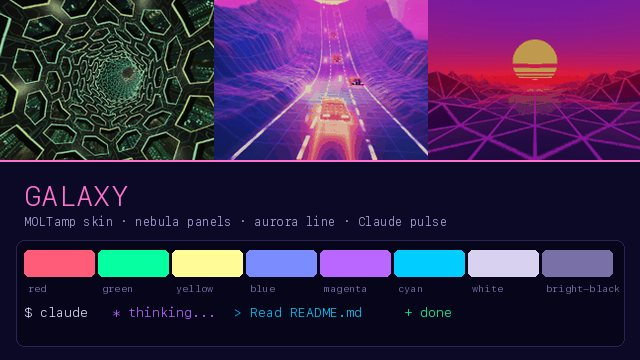

**Galaxy**: deep space in vaporwave pink, cyan and purple. Nebula panels under a twinkling star field, an aurora line under the banner, and a shell that breathes with Claude (purple while it thinks, a mint flash when it's done). Its banner GIF shows six of the shaders in motion, and its default layout puts the galaxy's widgets and the *Audio Galaxy* visualizer on stage.

Every effect can be switched off in the skin settings: *Glow*, *Nebula*, *Star Field*, *Aurora Line*, *Vibes Glow*, *Claude Pulse*.

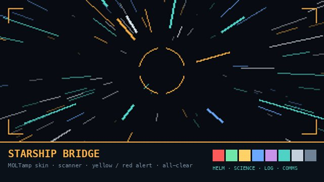

**Starship Bridge**: slate hull panels, amber instrument lights and teal readouts. A scanner sweeps under the main screen while Claude works, the side consoles pulse yellow when it waits for you and red on errors, and a green all-clear flashes when the task is done. Effects: *Glow*, *Hull Grid*, *Scanner*, *Alert Lights*, *Console Glow*.

## 🔭 Observatory

**Tune a widget**: each one reads its settings from `moltamp.settings`.

```json
{ "scale": 1, "maxPixels": 600000, "fpsCap": 60, "speed": 1, "reactive": true }
```

- `fpsCap: 30` saves battery (the heaviest stars already do).
- `speed: 2` doubles the speed; `reactive: false` stops following Claude.

**Get a visualizer's original colours back**: at the top of its `renderer.js`, set `var USE_SKIN_PALETTE = false;`.

**Launch your own star**: in `widgets/shadertoy-runner/index.html`, replace the `SHADER` object.
- Common, Buffer A-D and Image passes; `buffer`, `audio` and generated-texture inputs.
- The usual Shadertoy uniforms, plus a bonus: `iMoltamp = (energy, speed, state, pulse)`.

## 🧭 FAQ

<details>
<summary><b>Right-click doesn't open the slot menu</b></summary>

That's a MOLTamp limitation: right-clicks made inside a user widget never reach the host. Use **Settings** to add, remove or move a widget.
</details>

<details>
<summary><b>A line cuts Jupiter in half</b></summary>

In portrait slots the original shader tiles its flow texture. Put **Jupiter & Io** in a wide slot (the Vibes bar is perfect).
</details>

<details>
<summary><b>My Mac is getting warm</b></summary>

Lower `fpsCap` (30) or `maxPixels` (300000) in the widget settings. Hidden widgets (tab not shown) stop drawing entirely.
</details>

<details>
<summary><b>Rate Limit Fuel, Taxi Meter or Context Core say they are offline</b></summary>

They read Claude's status line through MOLTamp. If your Claude Code project sets its own `statusLine`, MOLTamp's never runs: chain MOLTamp's status line script into yours (feed it the same stdin) and they come alive.
</details>

<details>
<summary><b>The visualizers don't move with my music</b></summary>

MOLTamp captures your Mac's audio output through the screen and system audio permission. Turn MOLTamp on in **System Settings › Privacy & Security › Screen & System Audio Recording**, then quit (Cmd+Q) and relaunch it. Our visualizers show a small "♪ no audio signal" note when they only get silence.
</details>

<details>
<summary><b>Night Window doesn't know my city</b></summary>

Click the neon sign, type the city, press Enter. You can also write `"location": "Paris"` in the widget settings.
</details>

<details>
<summary><b>Why isn't this on the official MOLTamp store?</b></summary>

The official repos are MIT-licensed, while most of these shaders are CC BY-NC-SA 3.0. On top of that, the GPU visualizers use WebGL, and the visualizers repo only accepts pure Canvas 2D.
</details>

## ⭐ Star chart

All the light in this galaxy comes from the [Shadertoy](https://www.shadertoy.com) artists ❤️ Go visit the originals and leave them a like.

| Name | Original shader | Author | License |
|---|---|---|---|
| Artifakt Cubes | [artifakt](https://www.shadertoy.com/view/N3KGz3) | incre_ment | CC BY-NC-SA 3.0 |
| Coral Reef | [Coral Reef Y28](https://www.shadertoy.com/view/7X3GRS) | Yusef28 | CC BY-NC-SA 3.0 |
| Exusiai Jump | [Exusiai Jumping](https://www.shadertoy.com/view/7XK3zc) | KaltsitComeBack | CC BY-NC-SA 3.0 |
| Fibonacci Zoom | [Extruded Fibonacci Zoom](https://www.shadertoy.com/view/sfVGDG) | Shane | CC BY-NC-SA 3.0 |
| Fractal Kaleidoscope | [DeepSeek R1 - Audio Visual](https://www.shadertoy.com/view/lXVfW3) | Patan77 | CC BY-NC-SA 3.0 |
| Fractal Land | [Fractal Land](https://www.shadertoy.com/view/XsBXWt) | Kali | CC BY-NC-SA 3.0 |
| Hex Hive Tunnel | [Hexagonal Hive Lattice](https://www.shadertoy.com/view/73KGRd) | nobody93 | CC BY-NC-SA 3.0 |
| Infinite Hamsa | [Infinite Hamsa](https://www.shadertoy.com/view/7XK3Rc) | noztol | CC BY-NC-SA 3.0 |
| Jupiter & Io | [Jupiter and Io](https://www.shadertoy.com/view/XXjSRc) | edziewanowski | CC BY-NC-SA 3.0 |
| Liquid Warp | [Base warp fBM](https://www.shadertoy.com/view/tdG3Rd) | trinketMage | CC BY-NC-SA 3.0 |
| Mondrian Hexagons | [Mondrian Hexagon Infinity](https://www.shadertoy.com/view/sXGGzV) | DavidBraun | MIT |
| Neon Racer | [Vibe coded Shadertoy Wipeout](https://www.shadertoy.com/view/f3y3Rm) | Himred | CC BY-NC-SA 3.0 |
| Open Ocean | [Very fast procedural ocean](https://www.shadertoy.com/view/MdXyzX) | afl_ext | MIT |
| PRTS Dance | [普瑞赛斯的神秘前文明舞步](https://www.shadertoy.com/view/N3VGzm) | KaltsitComeBack | CC BY-NC-SA 3.0 |
| Psyche Skull | [.-=its a skurr=-.](https://www.shadertoy.com/view/Ws2Bzw) | im_paul_hi | CC BY-NC-SA 3.0 |
| Sound Candy | [Sound Candy Six](https://www.shadertoy.com/view/dlGXRD) | Pink | CC BY-NC-SA 3.0 |
| Spectralizer | [🎵🔥<<< SPECTRALIZER >>>🔥🎵](https://www.shadertoy.com/view/wXscWN) | chronos | CC BY-NC-SA 3.0 |
| Sunset Drive | [Sunset Drive Visualizer](https://www.shadertoy.com/view/dsXyRj) | Michal Klos & TheWindowStreamz | CC BY-NC-SA 3.0 |
| Synthwave Sunset | [Synthwave audio removed](https://www.shadertoy.com/view/clsfRr) | axiomgraph | CC BY-NC-SA 3.0 |

Original textures (photos, cubemaps) are replaced with generated ones, so no Shadertoy media is redistributed. Inigo Quilez's *Clouds* and *Elevated* are not ported: their license forbids it.

The **Cyberpunk District**, **Mission Control**, **Night Lounge**, **Starship**, *Audio Galaxy* and the **Galaxy** and **Starship Bridge** skins are original work by j0j0.

## 📜 License

The **Cyberpunk District**, **Mission Control**, **Night Lounge** and **Starship** widgets, *Audio Galaxy* and both skins are **MIT** (except the Galaxy skin's banner GIF, which shows CC ports). Most Shadertoy ports are **CC BY-NC-SA 3.0**: credit the authors, no commercial use, share alike.
*Open Ocean*, *Mondrian Hexagons* and the runner code are **MIT**. File-by-file details in [LICENSE.md](LICENSE.md).
*Exusiai Jump* and *PRTS Dance* are fan art of Arknights characters (owned by Hypergryph).

<div align="center"><sub>✨ Made somewhere between the terminal and the stars ✨</sub></div>
